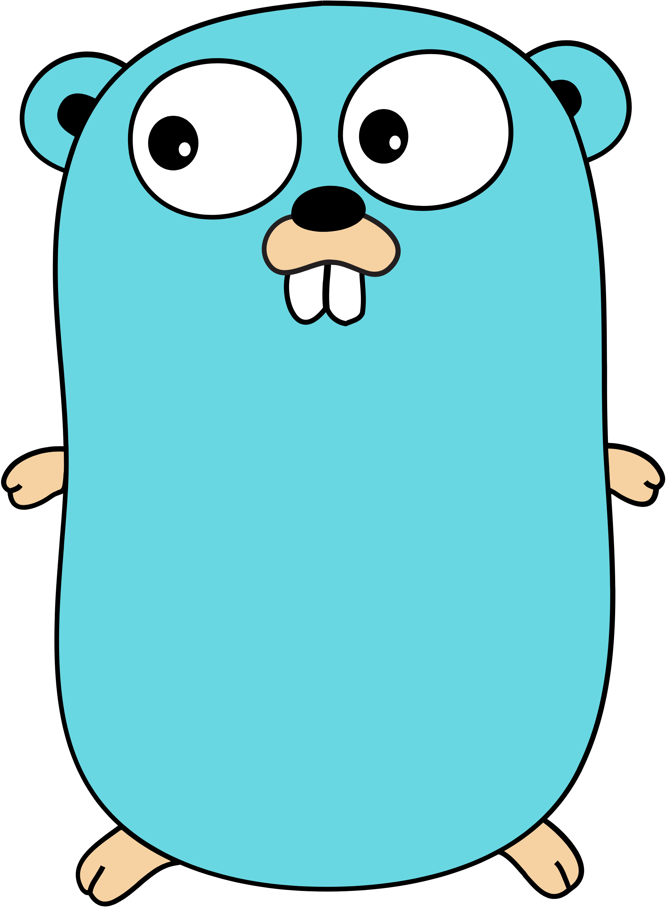
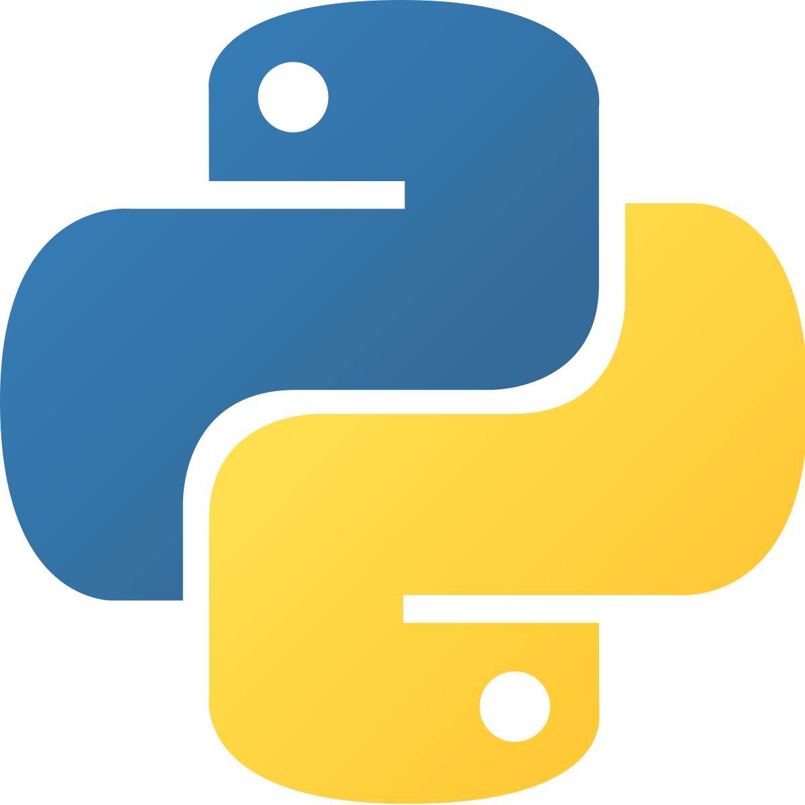
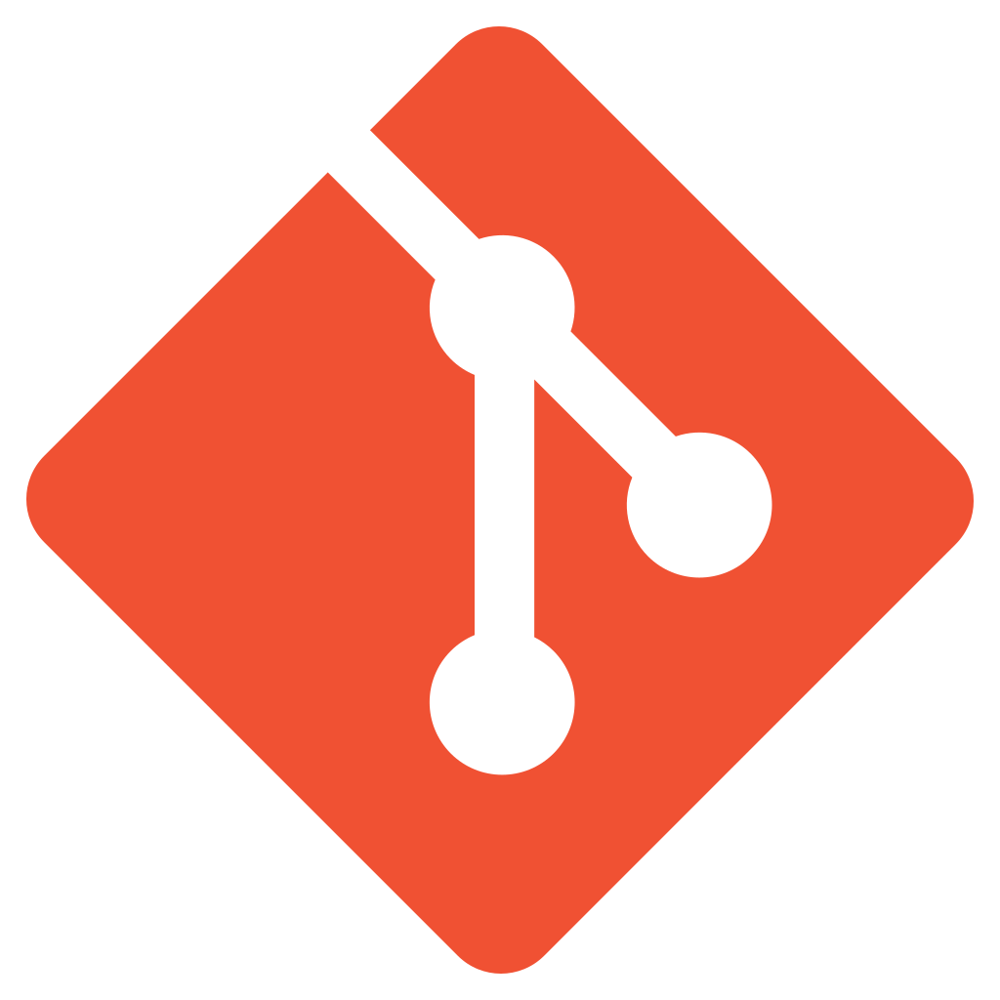

## Hi ! I'm Lisandro "Edode" Chelidze, and welcome to my Github page.

### I'm currently a student in Cybersecurity, but I'm working in Orange Cyberdefense as an apprentice.
- Golang | Python | Rust Developer
- Linux enthusiastic
- I love making codes bug free

### Languages and Tools: 🧰
<base href="../" >

    

        
        
        
        
        
        
        
        
        
    

